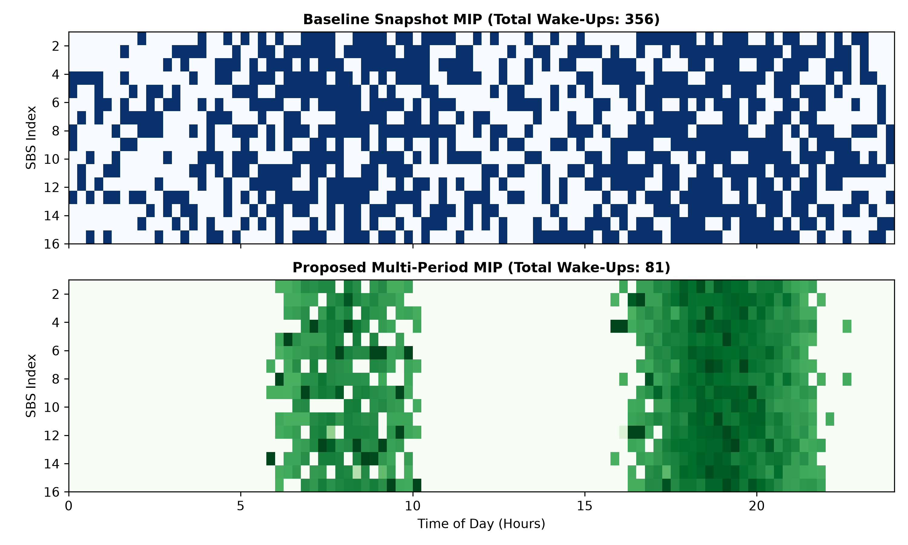

# HAPS 6G Multiperiod Cell Switching

[](https://www.python.org/)
[](https://opensource.org/licenses/MIT)
[](https://coin-or.github.io/pulp/)

This repository implements a HAPS-assisted 6G cell switching simulation and optimization framework. The project compares a baseline snapshot optimization against a multi-period formulation that accounts for wake-up transitions, battery state-of-charge (SoC), and temporal coupling over a full 24-hour traffic cycle.

## Project overview

The system models a heterogeneous network where small base stations (SBSs) can be activated or deactivated over time, while a High-Altitude Platform Station (HAPS) provides supplemental service capacity and battery support. The optimization goal is to reduce unnecessary switching and maintain efficient energy-aware operation, especially during periods of strong diurnal demand variation.

## Repository structure

```text
haps-6g-multiperiod-cell-switching/
├── README.md
├── requirements.txt
├── main.py
├── src/
│   ├── __init__.py
│   ├── network_model.py
│   ├── snapshot_mip.py
│   └── multiperiod_mip.py
├── results/
│   ├── ping_pong_comparison.png
│   └── haps_soc_profile.png
└── venv/
```

## Outputs

## Main components

### `main.py`
Runs the full simulation pipeline:
- generates traffic and solar profiles,
- solves the snapshot benchmark,
- solves the multi-period optimization,
- computes wake-up transition counts,
- saves comparison plots to the `results/` folder.

### `src/network_model.py`
Contains the network and environment generators:
- `generate_diurnal_traffic()` creates a 24-hour traffic profile across SBSs,
- `generate_solar_profile()` generates a diurnal HAPS solar-energy profile.

### `src/snapshot_mip.py`
Implements the independent snapshot optimization. Each time slot is solved separately without considering temporal transitions or energy dynamics.

### `src/multiperiod_mip.py`
Implements the multi-period optimization model. This version includes:
- binary on/off SBS decisions across time,
- wake-up transition penalties,
- battery SoC dynamics,
- HAPS offloading and charging constraints.

## Setup

1. Create a virtual environment:

```bash
python -m venv venv
```

2. Activate the virtual environment:

- Windows:

```bash
venv\Scripts\activate
```

- Linux/macOS:

```bash
source venv/bin/activate
```

3. Install dependencies:

```bash
pip install -r requirements.txt
```

## Run the project

```bash
python main.py
```

This will generate the result plots in the `results/` directory.

## Output figures

The simulation produces the following files in `results/`:

- `results/ping_pong_comparison.png` – Demonstrates a **77.2% reduction in state-toggling** (356 vs. 81 wake-ups) between the baseline snapshot MIP and proposed multi-period MIP.
- `results/haps_soc_profile.png` – Validates diurnal HAPS battery State-of-Charge (SoC) dynamics and cyclic energy behavior throughout the day.

## Dependencies

The project uses:
- NumPy
- Matplotlib
- SciPy
- PuLP
- Pandas

## Notes

- The simulation uses 96 time slots, corresponding to 15-minute intervals over a 24-hour period.
- The default setup models 16 SBSs.
- The multi-period formulation is designed to reduce unwanted ping-pong switching behavior while maintaining feasible HAPS battery operation.

## License

This project is intended for research and academic experimentation in HAPS-enabled 6G network optimization.
